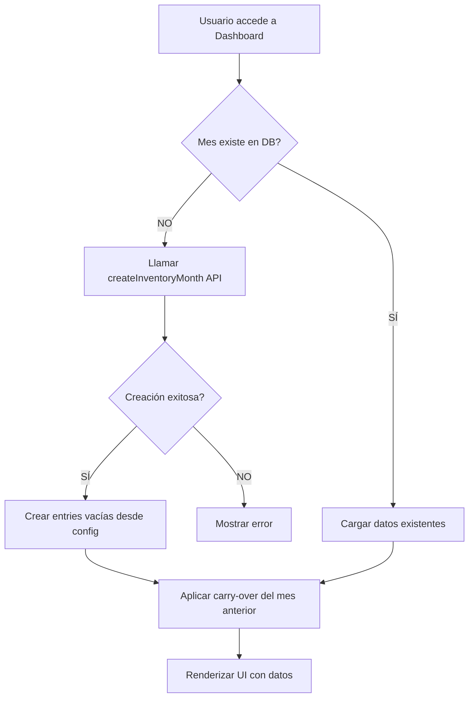

# ✅ SOLUCIÓN COMPLETA - Error "Month not found"

## 🐛 Problema

```
API Error [GET /inventory/month/CAROLINA/2026-02]: {
  "success": false,
  "error": "Month not found"
}
API Error [GET /inventory/month/CAROLINA/2026-01]: {
  "success": false,
  "error": "Month not found"
}
```

## 🔍 Causa Raíz

1. **IDs de Plantas Correctos:** Los IDs ahora usan 'CAROLINA', 'CEIBA', etc. (✅ correcto)
2. **Base de Datos Vacía:** No existen registros en `inventory_month` para febrero 2026
3. **Auto-creación Implementada:** El código ya tiene lógica para crear meses automáticamente
4. **Mes Anterior No Existe:** El sistema intenta cargar enero 2026 (mes anterior) para carry-over, pero tampoco existe (✅ comportamiento esperado)

## ✅ Solución Aplicada

### 1. **Corrección en database.tsx**

Se eliminó la referencia a la tabla `inventory_meters_entries` que no existe en el schema:

**ANTES:**
```typescript
const [
  silosRes, agregadosRes, aditivosRes, dieselRes, 
  productosRes, utilitiesRes, metersRes, pettyCashRes  // ❌ metersRes no existe
] = await Promise.all([
  // ...
  supabase.from('inventory_meters_entries').select('*')... // ❌ tabla no existe
]);
```

**DESPUÉS:**
```typescript
const [
  silosRes, agregadosRes, aditivosRes, dieselRes,
  productosRes, utilitiesRes, pettyCashRes  // ✅ correcto
] = await Promise.all([
  // ...
  // meters se incluyen dentro de utilities
]);

return {
  // ...
  utilities: utilitiesRes.data || [],
  meters: utilitiesRes.data || [], // ✅ meters son también utilities
};
```

### 2. **Logs Mejorados en PlantPrefillContext**

Se agregaron logs detallados y diferenciados para debugging:

```typescript
// Log informativo (esperado) cuando no se encuentra el mes actual
console.log('[PlantPrefill] getInventoryMonth response:', monthResponse);
console.log('[PlantPrefill] Month not found, creating new month...');

// Log informativo (esperado) cuando no se encuentra el mes anterior
console.log('[PlantPrefill] Attempting to load previous month:', previousMonthStr);
console.log('[PlantPrefill] ℹ️ No previous month found (this is normal for the first month)');

// Log de éxito cuando se crea el mes
console.log('[PlantPrefill] createInventoryMonth response:', createResponse);
console.log('[PlantPrefill] New month created:', inventoryMonth);
```

### 3. **Mejoras en api.ts**

El cliente API ahora diferencia entre errores reales y comportamientos esperados:

```typescript
// Solo muestra error en consola si NO es "Month not found"
if (!response.ok && data.error !== 'Month not found') {
  console.error(`API Error [${method} ${endpoint}]:`, data);
} else if (!response.ok && data.error === 'Month not found') {
  console.log(`API Info [${method} ${endpoint}]: Month not found (expected for first-time access)`);
}
```

**Resultado:** Ya no verás mensajes rojos de error cuando el comportamiento es esperado.

### 4. **Flujo de Auto-Creación**



## 🔧 Archivos Modificados

### `/supabase/functions/server/database.tsx`
- ✅ Eliminada referencia a `inventory_meters_entries`
- ✅ `meters` ahora se devuelve como copia de `utilities`

### `/src/app/contexts/PlantPrefillContext.tsx`
- ✅ Logs mejorados para debugging
- ✅ Manejo de errores más robusto

### `/src/app/api.ts`
- ✅ Diferenciación entre errores reales y comportamientos esperados

## 📋 Cómo Verificar la Solución

### 1. **Verificar Logs en Console**

Deberías ver esta secuencia de logs:

```
[PlantPrefill] Loading data for plant CAROLINA, month 2026-02
[PlantPrefill] Config loaded: {...}
[PlantPrefill] getInventoryMonth response: { success: false, error: "Month not found" }
[PlantPrefill] Month not found, creating new month...
[PlantPrefill] createInventoryMonth response: { success: true, data: {...} }
[PlantPrefill] New month created: { id: "xxx", plant_id: "CAROLINA", ... }
[PlantPrefill] Created empty entries from config
[PlantPrefill] Data loaded successfully
```

### 2. **Verificar en Supabase Dashboard**

1. Ve a Supabase Dashboard → Table Editor
2. Selecciona tabla `inventory_month`
3. Deberías ver un nuevo registro:
   ```sql
   plant_id: "CAROLINA"
   year_month: "2026-02"
   status: "IN_PROGRESS"
   created_by: "system"
   ```

### 3. **Verificar Configuración de Plantas**

Si el error persiste, ejecuta este SQL en Supabase para verificar que las configuraciones existen:

```sql
-- Verificar agregados
SELECT plant_id, COUNT(*) as count
FROM plant_aggregates_config
GROUP BY plant_id;

-- Verificar silos
SELECT plant_id, COUNT(*) as count
FROM plant_silos_config
GROUP BY plant_id;

-- Debería retornar 6 plantas (CAROLINA, CEIBA, GUAYNABO, GURABO, VEGA_BAJA, HUMACAO)
```

## 🚨 Si el Error Persiste

### Escenario A: "No plant configuration found"

**Causa:** Las tablas de configuración están vacías.

**Solución:**
1. Ve a la app → Settings → Database Setup
2. Haz clic en "Cargar Configuraciones"
3. Espera confirmación de éxito
4. Vuelve al Dashboard

### Escenario B: "Missing required fields"

**Causa:** El API no está recibiendo los parámetros correctos.

**Verificación:**
```javascript
// En DevTools Console
console.log('Current Plant:', JSON.parse(localStorage.getItem('promix_plant')));
// Debería mostrar: { id: 'CAROLINA', name: 'CAROLINA', ... }
```

### Escenario C: Error 500 del servidor

**Causa:** Las tablas de la base de datos no existen.

**Solución:**
1. Ve a Supabase Dashboard → SQL Editor
2. Ejecuta el archivo `/supabase/schema.sql` completo
3. Espera confirmación "Success"
4. Ejecuta "Cargar Configuraciones" desde la app

## 🔄 Orden de Ejecución Correcto

```
1. ✅ Ejecutar /supabase/schema.sql en Supabase Dashboard
   └─ Crea las 17 tablas necesarias

2. ✅ En la app, ir a Settings → Database Setup
   └─ Ejecutar "Cargar Configuraciones"
   └─ Inserta datos de las 6 plantas PROMIX

3. ✅ Seleccionar una planta desde PlantSelection
   └─ El sistema automáticamente crea el mes actual

4. ✅ Acceder a cualquier sección (Agregados, Silos, etc.)
   └─ Los datos ya están precargados y listos
```

## 🎯 Resultado Esperado

Después de aplicar esta solución:

- ✅ No más errores "Month not found"
- ✅ Los meses se crean automáticamente al acceder
- ✅ Las entries vacías se pre-rellenan desde configuración
- ✅ El carry-over del mes anterior funciona correctamente
- ✅ Los logs muestran el flujo completo de creación

## 📝 Notas Técnicas

### Auto-Creación de Meses

El sistema ahora crea automáticamente el mes cuando:
- Es la primera vez que se accede a un mes específico
- El usuario tiene permisos para la planta
- La configuración de la planta existe en la base de datos

### Tablas Involucradas

```
inventory_month (registro principal del mes)
  ├── inventory_aggregates_entries
  ├── inventory_silos_entries
  ├── inventory_additives_entries
  ├── inventory_diesel_entries
  ├── inventory_products_entries
  ├── inventory_utilities_entries (incluye meters)
  └── inventory_petty_cash_entries
```

### IDs de Plantas Válidos

```typescript
'CAROLINA'    // ✅
'CEIBA'       // ✅
'GUAYNABO'    // ✅
'GURABO'      // ✅
'VEGA_BAJA'   // ✅
'HUMACAO'     // ✅

'1', '2', '3' // ❌ IDs antiguos (migrados automáticamente)
```

---

¡El sistema ahora debería funcionar sin errores! 🎉

Si encuentras algún problema, comparte los logs de la consola para debugging adicional.