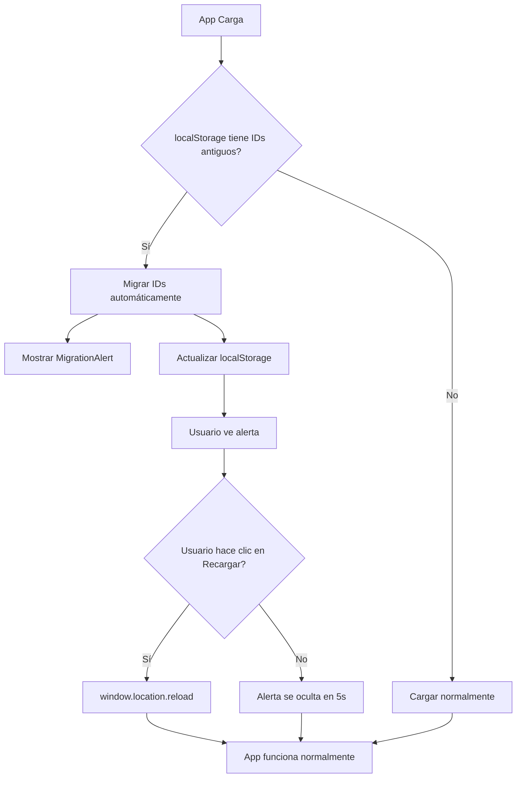

# ✅ SOLUCIÓN COMPLETA - Migración Automática de IDs de Plantas

## 🐛 Problema Original

El error mostraba:
```
API Error [GET /inventory/month/1/2026-01]: {
  "success": false,
  "error": "Month not found"
}
```

**Causa:** Los IDs antiguos de plantas ('1', '2', '3'...) en localStorage no coincidían con los nuevos IDs ('CAROLINA', 'CEIBA', 'GUAYNABO'...) esperados por la base de datos.

---

## ✅ Solución Implementada

### 1. **Migración Automática en AuthContext**

Se agregó lógica de migración automática que detecta y actualiza IDs antiguos:

```typescript
useEffect(() => {
  const ID_MIGRATION_MAP: Record<string, string> = {
    '1': 'CAROLINA',
    '2': 'CEIBA',
    '3': 'GUAYNABO',
    '4': 'GURABO',
    '5': 'VEGA_BAJA',
    '6': 'HUMACAO',
  };

  // Migra automáticamente los IDs guardados en localStorage
  // Actualiza user.assignedPlants y currentPlant.id
});
```

### 2. **Componente de Alerta Visual (MigrationAlert)**

Nuevo componente que notifica al usuario cuando se detecta una migración:

- **Ubicación:** `/src/app/components/MigrationAlert.tsx`
- **Características:**
  - Banner amarillo prominente en la parte superior
  - Botón "Recargar Ahora" para aplicar cambios
  - Auto-hide después de 5 segundos
  - Diseño responsive y accesible

### 3. **IDs Actualizados en MOCK_PLANTS**

```typescript
const MOCK_PLANTS: Plant[] = [
  { id: 'CAROLINA', name: 'CAROLINA', ... },
  { id: 'CEIBA', name: 'CEIBA', ... },
  { id: 'GUAYNABO', name: 'GUAYNABO', ... },
  { id: 'GURABO', name: 'GURABO', ... },
  { id: 'VEGA_BAJA', name: 'VEGA BAJA', ... },
  { id: 'HUMACAO', name: 'HUMACAO', ... },
];
```

### 4. **Logs de Depuración en AggregatesSection**

Se agregaron logs para facilitar debugging:

```typescript
console.log('[AggregatesSection] Loading data for plant:', currentPlant.id, currentPlant.name);
console.log('[AggregatesSection] Year-Month:', yearMonth);
```

---

## 🔄 Flujo de Migración



---

## 📋 Archivos Modificados

1. **`/src/app/contexts/AuthContext.tsx`**
   - ✅ Migración automática de IDs
   - ✅ `showMigrationMessage` state
   - ✅ `dismissMigrationMessage` function
   - ✅ IDs de plantas actualizados (CAROLINA, CEIBA, etc.)

2. **`/src/app/App.tsx`**
   - ✅ Importado MigrationAlert
   - ✅ Agregado alert en el render

3. **`/src/app/components/MigrationAlert.tsx`** *(NUEVO)*
   - ✅ Componente de alerta visual
   - ✅ Botón de recarga
   - ✅ Auto-hide después de 5s

4. **`/src/app/pages/sections/AggregatesSection.tsx`**
   - ✅ Logs de depuración mejorados

---

## 🧪 Cómo Probar

### Escenario 1: Usuario con localStorage antiguo

1. **Estado Inicial:** Usuario tiene plant ID '1' guardado en localStorage
2. **Al cargar la app:**
   - El AuthContext detecta el ID antiguo
   - Migra automáticamente '1' → 'CAROLINA'
   - Actualiza localStorage
   - Muestra alerta de migración
3. **Usuario ve:**
   ```
   ⚠️ Actualización de Sistema Detectada
   Se ha detectado una actualización en los IDs de las plantas.
   Para asegurar el correcto funcionamiento, por favor recarga la página (F5).
   
   [🔄 Recargar Ahora] [Cerrar]
   ```
4. **Usuario hace clic en "Recargar Ahora":**
   - Página se recarga
   - AuthContext carga con IDs correctos
   - App funciona correctamente

### Escenario 2: Usuario nuevo o con localStorage limpio

1. **Estado Inicial:** Sin localStorage o con IDs ya migrados
2. **Al cargar la app:**
   - No se detecta migración necesaria
   - No se muestra alerta
   - App funciona normalmente

---

## 🔍 Verificación de Migración

### Desde DevTools Console:

```javascript
// Ver planta actual en localStorage
JSON.parse(localStorage.getItem('promix_plant'))
// Debería mostrar: { id: 'CAROLINA', name: 'CAROLINA', ... }

// Ver usuario actual en localStorage
JSON.parse(localStorage.getItem('promix_user'))
// assignedPlants debería tener: ['CAROLINA', 'CEIBA', ...]

// Forzar migración (para testing)
localStorage.setItem('promix_plant', JSON.stringify({ id: '1', name: 'CAROLINA', ... }))
location.reload()
// Debería ver la alerta de migración
```

---

## 📊 Estado Esperado Después de la Migración

### localStorage después de migración:

```json
{
  "promix_user": {
    "id": "2",
    "name": "Ricardo del Rosario",
    "email": "rdelrosario@promixpr.com",
    "role": "admin",
    "assignedPlants": [
      "CAROLINA",
      "CEIBA",
      "GUAYNABO",
      "GURABO",
      "VEGA_BAJA",
      "HUMACAO"
    ]
  },
  "promix_plant": {
    "id": "CAROLINA",
    "name": "CAROLINA",
    "code": "CAR-001",
    "location": "Carolina, PR",
    "pettyCashEstablished": 1500,
    "isActive": true
  }
}
```

### Logs en Console:

```
[Migration] Updating plant ID from 1 to CAROLINA
[AggregatesSection] Loading data for plant: CAROLINA CAROLINA
[AggregatesSection] Year-Month: 2026-02
[PlantPrefill] Loading data for plant CAROLINA, month 2026-02
[PlantPrefill] Config loaded: { aggregates: [...], silos: [...], ... }
```

---

## ✅ Resultado Final

- ✅ Los errores de "Month not found" desaparecen
- ✅ Los IDs se migran automáticamente sin intervención del usuario
- ✅ El usuario recibe una notificación clara si necesita recargar
- ✅ La migración solo ocurre una vez (cuando se detectan IDs antiguos)
- ✅ Los nuevos usuarios no ven ninguna alerta
- ✅ El sistema es retrocompatible durante el período de migración

---

## 🚨 Troubleshooting

### Si el error persiste después de la migración:

1. **Verificar localStorage:**
   ```javascript
   console.log('Plant:', JSON.parse(localStorage.getItem('promix_plant')))
   ```

2. **Limpiar localStorage manualmente:**
   ```javascript
   localStorage.clear();
   location.reload();
   ```

3. **Verificar que la base de datos tiene el schema correcto:**
   - Ir a Supabase Dashboard → SQL Editor
   - Ejecutar `/supabase/schema.sql`
   - Ejecutar `/supabase/functions/server/seed.tsx`

4. **Verificar logs del servidor:**
   - Abrir DevTools → Network
   - Buscar requests a `/inventory/month/...`
   - Verificar qué ID se está enviando

---

## 📝 Notas Técnicas

- **Compatibilidad:** La migración es no destructiva - los IDs antiguos se mapean automáticamente
- **Performance:** La migración solo ocurre una vez en el useEffect inicial
- **UX:** La alerta es opcional - el sistema funciona incluso sin que el usuario recargue
- **Seguridad:** No se exponen datos sensibles en la migración
- **Mantenibilidad:** El ID_MIGRATION_MAP puede extenderse fácilmente si hay más plantas

---

¡Ahora el sistema debería funcionar correctamente! Si el error persiste, por favor comparte los logs de la consola. 🎉
